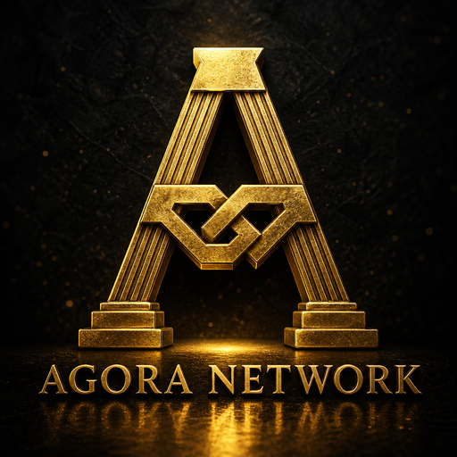

<p align="center">
  
</p>

<h1 align="center">Agora Network</h1>

<p align="center">
  <strong>Sovereign BlockDAG L1</strong> — GHOSTDAG consensus, UTXO settlement, RandomX PoW.<br/>
  Native asset <strong>TLT</strong> (Talanton). Built in Rust.
</p>

<p align="center">
  <a href="https://github.com/Tsoympet/agora-network/actions/workflows/ci.yml"></a>
  <a href="LICENSE-MIT"></a>
  
  
  
  
</p>

---

## About

Agora is a proof-of-work **BlockDAG**: blocks can reference multiple parents, ordered by **GHOSTDAG**, with a single-asset L1 UTXO ledger denominated in **TLT**. Peers sync with headers-first IBD over libp2p; wallets talk JSON-RPC.

| Mark | Layer | Consensus | Analog | Role |
| --- | --- | --- | --- | --- |
| **TLT** (Talanton) | L1 | Pure PoW (RandomX) | Bitcoin | BlockDAG UTXO settlement |
| **OVL** (Ovolos) | L2 | Hybrid PoW mint + bonded sequencers | Ethereum | EVM gas + smart-contract money |
| **DRC** (Drachma) | L3 | Hybrid PoW mint + bonded attestors | XRP | Payments / path payments / bridge rail |

See [`docs/scaling/TOKEN_ROLES.md`](docs/scaling/TOKEN_ROLES.md).

> **Status:** Testnet genesis is **frozen in-repo** and the three-mark stack is **role-complete in-tree** (TLT≈Bitcoin fee market, OVL≈Ethereum EVM+eth_*, DRC≈XRP payments/tags). **Mainnet is not frozen** — `AGORA_NETWORK=mainnet` refuses to boot. L2–L4 run in-process via `agora-layers`; public multi-node deploy is still ops.

## Features

- **GHOSTDAG + virtual tip** — blue-set ordering, UTXO apply/reorg journals
- **PoW** — RandomX (CPU; testnet/mainnet policy); kHeavyHash available on `dev` / stratum
- **P2P** — libp2p gossipsub, compact blocks, GetBlock / GetHeaders IBD, durable orphans & headers
- **State** — RocksDB column families (`hot` / `warm` / `archival` / `meta` / `utxo`)
- **JSON-RPC** — tips, blocks, txs, mempool, UTXOs, templates, fee estimate, optional Bearer auth
- **Wallets** — BIP-39/44 (`m/44'/8888'/…`), Bech32m addresses, AES-GCM vault (desktop / mobile)
- **Tooling** — miner sidecar, HTTP seeder, faucet, explorer, Docker Compose

## Networks

| | `dev` | `testnet` | `mainnet` |
| --- | --- | --- | --- |
| Genesis | Free-form | **Frozen** | Not frozen |
| Address HRP | `agoradev` | `agoratest` | `agora` |
| PoW | RandomX (env override OK) | RandomX only | RandomX only (planned) |
| Coin type | `8888` (provisional SLIP-0044) | same | same |

**Testnet genesis hash**

```text
afe59232cd20a16bd56948044149d2b8013e63f3694c113074fef75ab0cb9b98
```

Artifact: [`docs/genesis/testnet.genesis.json`](docs/genesis/testnet.genesis.json)

## Quick start

### Prerequisites

- Rust stable (`rust-toolchain.toml`)
- On Linux: `cmake`, `clang`, `g++` (RandomX / RocksDB)
- Optional: Node 20+ for explorer / desktop / mobile

### Single node (testnet)

```bash
git clone https://github.com/Tsoympet/agora-network.git
cd agora-network

# Verify frozen genesis
cargo run -p agora-node -- genesis verify --network testnet

# Run full node (RocksDB under AGORA_DATA)
AGORA_NETWORK=testnet \
AGORA_RPC_BIND=127.0.0.1:8545 \
cargo run -p agora-node
```

```bash
curl -s http://127.0.0.1:8545/rpc \
  -H 'content-type: application/json' \
  -d '{"id":1,"method":"agora_getDagTips","params":[]}'
```

### Two-node local testnet

```bash
cargo build -p agora-dns-seeder -p agora-node -p agora-miner-sidecar

./scripts/local_testnet.sh wipe-two
# terminals:
./scripts/local_testnet.sh seeder
./scripts/local_testnet.sh node-a
./scripts/local_testnet.sh node-b
./scripts/local_testnet.sh smoke-ibd    # mine N blocks, wait for tip sync
./scripts/local_testnet.sh smoke-tx     # signed tx gossip
```

### Docker

```bash
docker compose up --build seeder node-a
docker compose run --rm miner          # RandomX sidecar
docker compose up faucet               # capped mint faucet
```

See [`docs/ops/PUBLIC_TESTNET.md`](docs/ops/PUBLIC_TESTNET.md).

### Mine (RandomX)

```bash
AGORA_RPC_URL=http://127.0.0.1:8545/rpc cargo run -p agora-miner-sidecar
```

### Install CLI (releases)

After a `v*` tag is published:

```bash
curl -fsSL https://raw.githubusercontent.com/Tsoympet/agora-network/main/scripts/install.sh | bash
# → ~/.local/bin/{agora-node,agora-layers,agora-miner}
```

Or download `agora-cli-<os>-<arch>.tar.gz` / `.zip` from
[GitHub Releases](https://github.com/Tsoympet/agora-network/releases).
Local package: `./scripts/package-cli.sh`.

### Clients

Apps show **Devnet / Testnet / Mainnet** from the connected node and use matching Bech32 HRPs.
Desktop (Win/macOS/Linux) and mobile (iOS/Android) packaging: [`docs/apps/PLATFORMS.md`](docs/apps/PLATFORMS.md).

```bash
cd apps/explorer && npm install && npm run dev        # BlockDAG explorer
cd apps/desktop  && npm install && npm run tauri:dev  # wallet (Tauri) / npm run dev for browser
cd apps/mobile   && npm install && npm start          # Expo light client
```


### L2 / L3 / L4 (operator runtime)

```bash
cargo run -p agora-layers   # JSON-RPC on 127.0.0.1:8555 — see docs/scaling/OVERVIEW.md
```

## Architecture

```text
┌─────────────┐   gossip / GetHeaders / GetBlock   ┌─────────────┐
│  agora-node │ ◄────────────────────────────────► │  agora-node │
└──────┬──────┘                                    └─────────────┘
       │ JSON-RPC
       ▼
┌──────────────┐   ┌─────────────┐   ┌──────────┐
│ miner-sidecar│   │  explorer   │   │  wallets │
│ (RandomX)    │   │  faucet     │   │ desktop/ │
└──────────────┘   └─────────────┘   │ mobile   │
                                     └──────────┘
```

| Layer | Path | Responsibility |
| --- | --- | --- |
| Consensus | `core/crates/consensus` | GHOSTDAG, DAA, PoW, emission |
| State | `core/crates/state-machine` | RocksDB, UTXO, genesis, headers |
| P2P | `core/crates/p2p` | libp2p, mempool, IBD |
| RPC | `core/crates/rpc` | JSON-RPC methods + dispatch |
| Node | `core/node-bin` | Process wiring |
| Clients | `apps/*` | Explorer, desktop, mobile |
| Infra | `infrastructure/*` | Seeder, stratum, faucet |

Full workspace map: [`PROJECT_STRUCTURE.md`](PROJECT_STRUCTURE.md)

## Documentation

| Document | Description |
| --- | --- |
| [Public testnet ops](docs/ops/PUBLIC_TESTNET.md) | Docker, seeds, PoW policy, TLS |
| [Path to complete chain](docs/governance/PATH_TO_COMPLETE_CHAIN.md) | What’s done vs mainnet gates |
| [Genesis](docs/genesis/README.md) | Frozen testnet / mainnet draft |
| [RPC](docs/core/rpc.md) · [OpenAPI](docs/core/openapi.yaml) | JSON-RPC surface |
| [P2P](docs/core/p2p.md) · [Consensus](docs/core/consensus.md) | Protocol notes |
| [Mainnet freeze](docs/governance/MAINNET_GENESIS_FREEZE.md) | Freeze checklist |
| [SLIP-0044](docs/governance/SLIP0044.md) | Provisional coin type `8888` |
| [Brand system](docs/brand/BRAND_SYSTEM.md) | Obsidian & Gold |
| [Roadmap](AGORA_MASTER_EXECUTION_ROADMAP.md) | Execution phases |

## Develop & test

```bash
cargo fmt --all -- --check
cargo test --workspace   # prefer CI matrix for RandomX-heavy crates

# Portable CI subset (no cmake):
cargo test -p agora-types -p agora-crypto -p agora-rpc -p agora-state-machine

# Node + RandomX (slow):
cargo test -p agora-node --bin agora-node
```

CI: [`.github/workflows/ci.yml`](.github/workflows/ci.yml)

## Contributing

1. Read [`AGENTS.md`](AGENTS.md) and [`PROJECT_STRUCTURE.md`](PROJECT_STRUCTURE.md).
2. Keep consensus crypto on audited crates (`secp256k1`, `bip39`) — no custom curves.
3. Prefer small, reviewable PRs against `main`.
4. Regenerate `ts-rs` bindings when changing `agora-types`.

## Security

See [`SECURITY.md`](SECURITY.md). Report vulnerabilities privately; do not put mainnet value on unfrozen networks.

## License

Licensed under either of:

- Apache License, Version 2.0 — [`LICENSE-APACHE`](LICENSE-APACHE)
- MIT license — [`LICENSE-MIT`](LICENSE-MIT)

at your option.

`agora-kheavyhash` includes ISC-licensed Kaspa algorithm code — see [`core/crates/kheavyhash/LICENSE-ISC`](core/crates/kheavyhash/LICENSE-ISC).

---

<p align="center">
  <sub>Obsidian <code>#101218</code> · Burnished Gold <code>#C59835</code> · Aegean Cyan <code>#06BBDF</code></sub>
</p>
