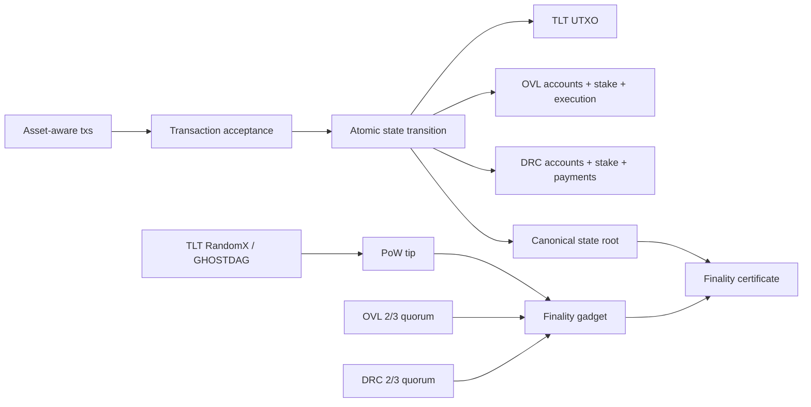

# Agora Trident L1

**Maturity:** Scaffold (architecture approved for implementation).  
**Not** public-testnet ready. **Not** mainnet ready.

Agora Trident L1 is a single hybrid Layer 1 BlockDAG with three protocol-native assets and a community ecosystem. It replaces the layered assumption that OVL exists only on L2 and DRC only on L3.

For the Phase 0 audit, gap analysis, impact map, PR sequence, and risk register see [`TRIDENT_PHASE0_AUDIT.md`](TRIDENT_PHASE0_AUDIT.md).

---

## Native assets

| ID | Asset | Wire | Mineable | Role |
| --- | --- | --- | --- | --- |
| `TLT` | Talanton | `0x00` | **Yes** (RandomX) | Block proposal, settlement, censorship resistance, security reserves, base fees |
| `OVL` | Ovolos | `0x01` | Never | Smart-contract gas, developer economy, OVL validator collateral, technical governance |
| `DRC` | Drachma | `0x02` | Never | Payments, merchants, community economy, DRC validator collateral, community governance |

All three are **protocol-native**. They are not ERC-20 or application tokens. OVL is not Ethereum-equivalent. DRC is not XRPL-equivalent and is not a stablecoin unless a separately audited stabilizer exists.

---

## Canonical ledger

One chain ID, one genesis, one state-transition version, one state root. No separate incompatible chain per token.

---

## Hybrid consensus (summary)

- **TLT miners** propose and order blocks (GHOSTDAG preserved from hardened `main`).
- **OVL validators** and **DRC validators** independently sign the same checkpoint.
- Final only when PoW work threshold **and** both PoS quorums hold.
- PoW may advance while PoS is unavailable; blocks remain **unfinalized**.
- No administrator bypass; no price-oracle stake mixing.

Details: [`../consensus/HYBRID_POW_DUAL_POS.md`](../consensus/HYBRID_POW_DUAL_POS.md).

---

## State model (decision)

**Mixed model:** TLT remains UTXO; OVL and DRC use native account modules (balances, nonces, staking, vesting, treasuries, execution/payment substate). All commit atomically into one state root.

Rationale: preserve consensus-hardening on the TLT UTXO path (PRs #76–#81); align OVL execution and DRC payments with account semantics without maintaining two OVL balance definitions.

---

## Transaction acceptance

Explicit acceptance is the sole authority for mutation, fees, confirmations, mempool eviction, and explorer status. Block color never implies confirmation.

Statuses: `Accepted` | `ExactDuplicate` | `ConflictLost` | `Invalid`.

Concepts are ported from the unmerged-to-main acceptance lineage (#82–#84) onto `main`’s Virtual soft-skip path — the divergent scaffold branch is **not** merged wholesale.

---

## Fee categories

1. **TLT** — base network (bytes, state growth, anti-spam, inclusion) → miners (+ policy burn/treasury).  
2. **OVL** — execution (compute, storage, deploy) → OVL validators / builder treasury / burn.  
3. **DRC** — payments (transfers, merchants, tags, escrow) → DRC validators / community treasury / burn.

Sponsorship and wallet-assisted acquisition are allowed; consensus must not convert assets via external oracles. Fees credit only for `Accepted` txs.

---

## Community architecture (modules)

| Module | Purpose | Early maturity |
| --- | --- | --- |
| Agora Hubs | Geographic/specialist communities + treasuries | Scaffold |
| Agora Passport | Non-transferable contribution attestations | Scaffold |
| Agora Assembly | OVL Technical / DRC Community / Ecclesia / miner signaling | Scaffold → Experimental |
| Treasuries | TLT Security / OVL Builder / DRC Community | Scaffold |
| Grants & Missions | Micro, milestone, bounty, retro | Scaffold |
| Merchant Network | Payments UX over native DRC | Scaffold |

Docs under [`../community/`](../community/) and [`../governance/AGORA_CONSTITUTION.md`](../governance/AGORA_CONSTITUTION.md).

---

## Maturity levels (required vocabulary)

Use only these labels in docs and READMEs:

| Level | Meaning |
| --- | --- |
| Scaffold | Types/schemas/docs; not consensus-live |
| Experimental | In-tree logic; may be incomplete |
| Single-node prototype | Runs locally; not multi-peer safe |
| Multi-node devnet | Converges among operators; not public |
| Public testnet | Shared network with frozen genesis + ops |
| Audited production | External audit + ops ready |
| Mainnet ready | Freeze + checklist complete |

Do **not** use “role-complete” as a substitute for the above.

---

## Implementation phases

| Phase | Focus |
| --- | --- |
| 0 | Audit & design freeze (this document set) |
| 1 | Shared types + genesis v3 |
| 2 | Multi-asset state transition + acceptance |
| 3 | Staking + dual-PoS finality |
| 4 | OVL execution + DRC payment modules |
| 5 | Governance & community systems |
| 6 | Migration tooling + layer retirement docs |
| 7 | Devnet / testnet preparation |

Genesis-loader prerequisite status: the integrated runtime can now stage and
commit genesis storage atomically and can derive all representable runtime
policy through one freeze-gated conversion. The bounded Block 0 prerequisite
now includes a versioned Borsh manifest (v2 binds chain ID and network
fingerprint), a lossless Meta envelope, and fail-closed overlay verification
before any durable candidate write. A separate domain- and version-gated
Trident header now commits the Block 0/body/state/policy/version identities
offline without changing frozen v2 bytes. It still does not materialize live
balances or provide a node loader entry point. A versioned Borsh datadir
identity now binds the chain, artifact, policy, Block 0 commitment, state root,
network fingerprint, and available header identity/hash in the same atomic
candidate batch. Legacy/v2 startup rejects that marker before libp2p identity
access, networking, or RPC; future Trident startup has an exact expected-byte
verification API at the same boundary.

A Trident v3 node loader remains blocked on the concrete body/PoW rules,
lossless atomic mappings for UTXOs, accounts, treasury controls, vesting locks,
validator runtime records and initial finality, and equality between the
materialized live-state root and header. Networking and RPC must remain
disabled for v3 until that live-state contract and explicit runtime gates exist.
See [`../core/block-zero.md`](../core/block-zero.md).

PR sequence: [`TRIDENT_PHASE0_AUDIT.md`](TRIDENT_PHASE0_AUDIT.md) §8.

---

## Related specs

- [`../assets/NATIVE_ASSETS.md`](../assets/NATIVE_ASSETS.md)
- [`../assets/MONETARY_POLICY.md`](../assets/MONETARY_POLICY.md)
- [`../staking/OVL_STAKING.md`](../staking/OVL_STAKING.md)
- [`../staking/DRC_STAKING.md`](../staking/DRC_STAKING.md)
- [`../core/finality.md`](../core/finality.md)
- [`../consensus/HYBRID_POW_DUAL_POS.md`](../consensus/HYBRID_POW_DUAL_POS.md)
- [`../migration/OVL_DRC_TO_L1.md`](../migration/OVL_DRC_TO_L1.md)
- [`../security/THREAT_MODEL.md`](../security/THREAT_MODEL.md)
- [`../testing/TRIDENT_TEST_PLAN.md`](../testing/TRIDENT_TEST_PLAN.md)
- [`../operations/VALIDATOR_RUNBOOK.md`](../operations/VALIDATOR_RUNBOOK.md)
- [`../operations/MINER_RUNBOOK.md`](../operations/MINER_RUNBOOK.md)
- [`../operations/INCIDENT_RESPONSE.md`](../operations/INCIDENT_RESPONSE.md)
