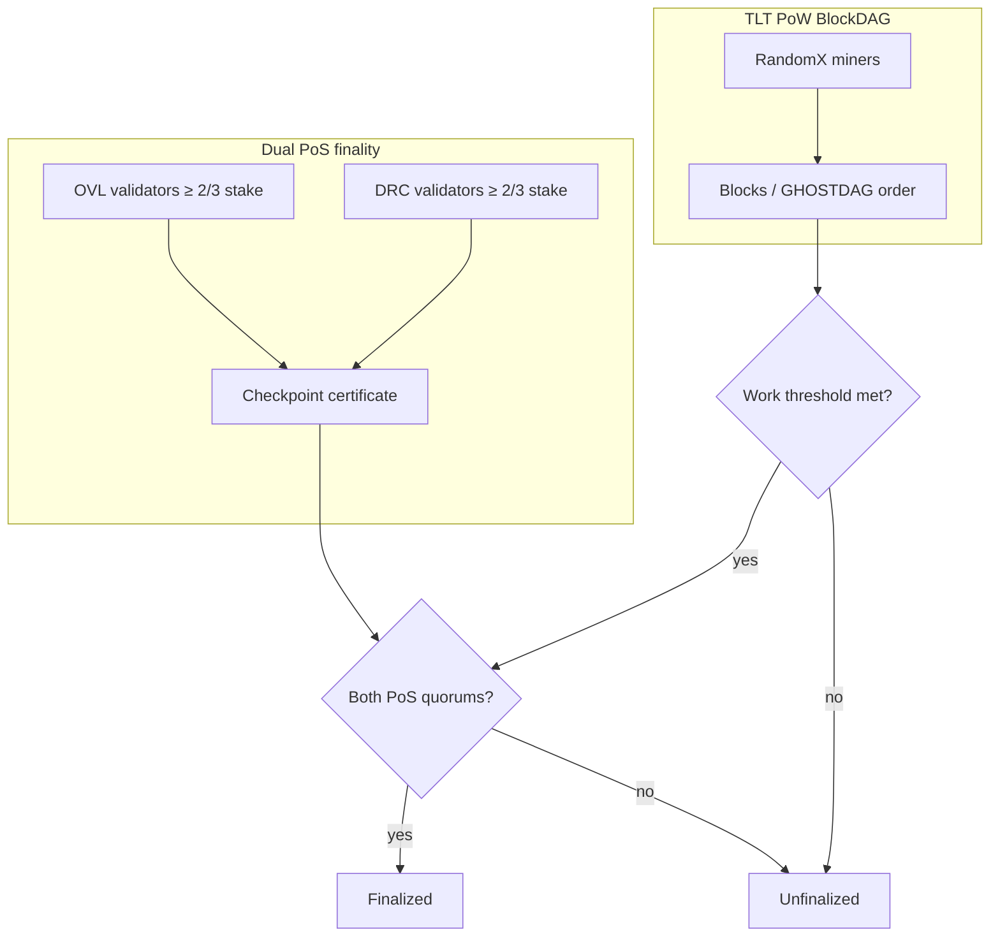

# Agora Trident L1 — Phase 0 Audit & Design Freeze

**Status:** Design freeze (documentation). No consensus-critical code lands in this document set.  
**Base audited:** `main` @ `7960fff` (merge of PR #81).  
**Date:** 2026-08-06  
**Maturity of this document:** Scaffold / design approval — **not** mainnet ready.

---

## 1. Current repository audit

### 1.1 Mission on `main` today

Agora on `main` is a **layered three-mark** design:

| Mark | Where money lives | Consensus |
| --- | --- | --- |
| **TLT** | L1 UTXO (`agora-node`) | Pure RandomX PoW + GHOSTDAG |
| **OVL** | L2 account ledger (`agora-ovolos-rollup`) | Hybrid sha256 PoW mint + bonded sequencers |
| **DRC** | L3 district ledger (`agora-bridge-sdk`) | Hybrid sha256 PoW mint + bonded attestors |

L2–L4 compose in-process via `agora-layers`. They are **not** a deployed public multi-chain network. `docs/scaling/TOKEN_ROLES.md` explicitly forbids putting OVL/DRC into L1 UTXO — that non-goal is **superseded** by Trident L1.

### 1.2 Crate map (preserve boundaries)

| Path | Role on `main` | Trident fate |
| --- | --- | --- |
| `core/crates/types` | BlockDAG primitives, single-asset `TxOut` | Extend: `NativeAssetId`, asset-aware values, acceptance types |
| `core/crates/crypto` | BIP-39/44, secp256k1 | Extend derivation roles; keep audited crates only |
| `core/crates/consensus` | GHOSTDAG, DAA, RandomX, emission | Keep; add finality gadget + dual PoS quorum |
| `core/crates/state-machine` | RocksDB zones, genesis v2, virtual UTXO | Multi-asset state root; schema versioning |
| `core/crates/p2p` | libp2p, mempool, fingerprint | Fingerprint domains for Trident versions |
| `core/crates/rpc` | JSON-RPC | Versioned asset / finality / staking RPCs |
| `core/crates/governance` | Admin civic prototype (Meta CF) | Evolve toward on-chain chambers; keep prototype labeled |
| `core/crates/ovolos-rollup` | L2 revm + OvlLedger | Reuse execution semantics → L1 OVL module |
| `core/crates/bridge-sdk` | L3 DRC payments | Reuse payment semantics → L1 DRC module |
| `core/crates/intent-engine` | L4 intents | App-layer / optional; not consensus |
| `core/crates/layers-runtime` + `layers-bin` | In-process compose | Deprecate as “canonical money”; may remain lab harness |
| `apps/*` | TLT wallets + explorer | Trident three-asset support |
| `infrastructure/*` | Seeder, faucet, stratum | Fee/treasury aware; no public mint RPCs |

### 1.3 Consensus hardening present on `main` (PRs #76–#81) — **must preserve**

These defects were fixed on `main` and must not be reintroduced:

| PR | Hardening (do not regress) |
| --- | --- |
| #76 | Canonical GHOSTDAG merge order; work-based tips; target-space DAA; RandomX epoch cache; atomic UTXO WriteBatch |
| #77 | `pending_virtual` reorg recovery; durable GHOSTDAG; height-anchored RandomX epochs |
| #78 | Parent-contextual DAA; pre-persist UTXO+sig dry-run; atomic DAG batch; compact mergeset; multi-inclusion tx index |
| #79 | Full `blue_order` UTXO proof; journal fee/subsidy; integer DAA; one coinbase; `consensus_policy_hash`; bound auth |
| #80 | Virtual soft-skip for DAG liveness; bound signing; P2P fingerprint; CoW overlay; coinbase uniqueness |
| #81 | Safe journal migration; Virtual reserve non-poisoning; no RandomX sleep under lock; force archival on testnet/mainnet |

**Current acceptance model on `main`:** `ApplyMode::{Strict, Virtual}` in `state-machine/src/apply.rs`. Under `Virtual`, first spend in `blue_order` wins; later duplicates/conflicts are soft-skipped. Fees come only from selectable (non-skipped) transfers. There is **no** `TransactionAcceptance` / `AcceptanceBitmap` type on `main`.

### 1.4 Acceptance work NOT on `main` (side-branch lineage)

PRs **#82–#84** introduced an explicit acceptance layer (`TxAcceptanceStatus`, `AcceptanceBitmap`, fee-only-from-accepted, atomic acceptance CF, fingerprint-bound mempool). They were merged into the divergent chain:

```text
cursor/agora-foundation-scaffold-c253
  → cursor/tx-acceptance-layer-389a (#82)
  → cursor/critical-security-hardening-389a (#83)
  → cursor/remaining-hardening-389a (#84)
```

That lineage is **not an ancestor of `main`**. A wholesale merge would regress #76–#81. Trident must **port the acceptance concepts** onto `main`’s hardened Virtual/UTXO path, not replace `main` with the scaffold branch.

Key reusable design from that branch (concepts, not blind copy):

- Full structural validation even when a tx loses a conflict
- Deterministic bitmap / status enum as sole confirmation authority
- Fee attribution only for `Accepted`
- Atomic persistence of acceptance + UTXO journal
- Mempool eviction keyed on acceptance
- RPC `getBlockAcceptance` / `getTxConfirmation`

### 1.5 Genesis & fingerprint (today)

- L1 testnet genesis **v2** frozen: `docs/genesis/testnet.genesis.json`, hash `afe59232…9b98`
- Separate OVL/DRC genesis JSON under `docs/genesis/`
- Fingerprint domain (`p2p/src/fingerprint.rs`): `agora-net-fp-v1` + protocol/tx/state-transition versions
- `STATE_TRANSITION_VERSION = "agora-utxo-virtual-v1"`
- Mainnet **not bootable** until freeze

### 1.6 OVL / DRC implementation reality

**OVL (`ovolos-rollup`):**

- `revm` executor + SHA-256 account digests (not Ethereum MPT)
- Parallel `OvlLedger` for mint/gas/bonds vs revm balances → **dual balance truth**
- Compact unsigned path with fixed funded caller `[0xA1;20]` → must die on L1
- Bonded sequencers are address-gated; batch auth is not full signed quorum crypto

**DRC (`bridge-sdk`):**

- Account balances per district; payment + destination tags + path pay
- Attestor “sign” path is set-membership of bonded addresses — **no secp256k1 attest verify**
- `InMemoryTransport` only; mutation-order hazards called out in product requirements must be audited when porting

**Maturity language on `main`:** README / `PATH_TO_COMPLETE_CHAIN.md` say “role-complete” / “engineering finalized.” Trident replaces that with explicit maturity levels (Scaffold → Mainnet ready). OVL is **not** Ethereum-equivalent; DRC is **not** XRPL-equivalent.

### 1.7 Governance & community (today)

| Feature | Status |
| --- | --- |
| Constitution text + chambers + ranks | Admin Meta CF prototype |
| Forum topics / constitution acks | Exists (unsigned, local) |
| Quadratic voting / whale cap | In-engine, not consensus-locked stake |
| Agora Hubs / Passport / Grants / Missions | **Missing** |
| Protocol treasuries (TLT/OVL/DRC) | Premine + faucet treasury only |
| On-chain proposal classes + timelocks | Partial civic engine; not hybrid finality-bound |

### 1.8 Wallets / explorer / RPC

- Wallets: **TLT-only** send; UI amounts often `number` (unsafe for `u64`)
- Explorer: pending/confirmed/unknown; no acceptance bitmap UI; `orphaned` under-typed in TS
- L1 RPC includes lab `agora_fundAddress` (gated); layers RPC exposes mint/credit — must never be enabled on shared testnet/mainnet for Trident

---

## 2. Gap analysis vs Agora Trident L1

| Trident requirement | `main` today | Gap severity |
| --- | --- | --- |
| Three protocol-native L1 assets | Only TLT on L1 | **Critical** |
| `NativeAssetId` + asset-tagged values | Implicit TLT only | **Critical** |
| Only TLT mineable | OVL/DRC layer PoW mint | **Critical** |
| OVL/DRC PoS validators on L1 | Layer bonds only | **Critical** |
| Finality = PoW depth ∧ OVL ⅔ ∧ DRC ⅔ | Pure PoW blues | **Critical** |
| Independent quorums (no price oracle) | N/A | Design + impl |
| One canonical state root | L1 UTXO + separate layer roots | **Critical** |
| Explicit `TransactionAcceptance` | Soft-skip `ApplyMode` only | **High** (port from #82 concepts) |
| Unified OVL monetary state | Dual ledger/revm | **High** |
| Atomic DRC payments + replay | Layer ledger; order bugs risk | **High** |
| Staking / unbonding / slashing | Missing on L1 | **Critical** |
| Fee categories + sponsorship | TLT fees only | **High** |
| Genesis v3 multi-asset | Genesis v2 + layer geneses | **Critical** |
| Hubs / Passport / Grants / Missions | Missing | Medium (scaffold OK early) |
| Chamber approval matrix | Partial civic prototype | Medium |
| Three protocol treasuries | Missing | Medium–High |
| Wallet three-asset + BigInt | TLT + `number` | **High** |
| Migration tooling | N/A (prefer genesis-native) | Medium (spec + dry-run) |
| Schema version / reindex | Ad hoc journal migrate | **High** |
| Honest maturity labels | Overstated “role-complete” | **High** (docs) |
| CI: RandomX + RocksDB + TS + Docker | Partial | Medium |

---

## 3. Proposed target architecture

### 3.1 One sentence

**Agora Trident L1** is a single canonical BlockDAG ledger where TLT RandomX miners propose and order blocks, OVL and DRC validator sets independently attest finality checkpoints, and all three assets share one state-transition function and one state root.

### 3.2 Hybrid consensus



**Finality predicate (all required):**

1. Cumulative TLT PoW depth / work ≥ policy threshold  
2. ≥ ⅔ active OVL voting stake signs the checkpoint  
3. ≥ ⅔ active DRC voting stake signs the checkpoint  

No market-price combining of stakes. No admin bypass that drops a quorum. PoW may continue while a PoS set is unavailable; those blocks stay **explicitly unfinalized**.

**Checkpoint lifecycle states:**

`Proposed` → `PoWAccepted` → `AwaitingOvlQuorum` / `AwaitingDrcQuorum` → `Finalized` | `RevertedOrOrphaned`

**Domain-separated attestation binds:** chain ID, genesis hash, consensus-policy hash, state-transition version, checkpoint height/blue score, checkpoint block hash, state root, validator-set epoch.

### 3.3 Native multi-asset state model (decision)

**Selected model: mixed canonical state**

| Asset | State representation | Rationale |
| --- | --- | --- |
| **TLT** | UTXO (preserve existing hardened path) | Settlement + mining coinbase already UTXO |
| **OVL** | Native account module + staking substate | Matches execution/gas; avoids dual EVM ledger |
| **DRC** | Native account module + staking/payment substate | Matches payments, tags, escrow |

All modules commit into **one Merkle/Borsh state root** applied atomically in the L1 transition. Cross-asset spends are rejected. No ERC-20 / application token confusion with native IDs.

```rust
pub enum NativeAssetId {
    TLT = 0x00,
    OVL = 0x01,
    DRC = 0x02,
}

pub struct NativeAmount {
    pub asset: NativeAssetId,
    pub value: Amount, // u64 base units
}
```

### 3.4 Monetary policy (summary)

| | TLT | OVL | DRC |
| --- | --- | --- | --- |
| Max supply | Fixed (preserve 100M whole @ 8dp unless genesis ceremony revises) | Fixed (preserve 21B whole @ 8dp as working default) | Fixed (preserve 6B whole @ 8dp as working default) |
| Issuance after genesis | PoW subsidy only | Genesis + staking emission reserve | Genesis + validator/community reserve |
| Mining | **Only** TLT | Never | Never |
| Fees | Base network | Execution gas | Payment fees |
| Governance mint | Forbidden | Forbidden | Forbidden |

Supply invariants (tested):

```text
issued_supply(asset) <= maximum_supply(asset)
sum(accounts + utxos + stake + unbonding + treasuries + escrow + burned_accounting)
  == expected_supply_state(asset)
```

### 3.5 Fee architecture

| Category | Asset | Pays for | Default entitlement |
| --- | --- | --- | --- |
| Base network | TLT | Bytes, state growth, anti-spam, inclusion | TLT miners (+ optional burn/treasury split in policy) |
| Execution | OVL | Compute, storage, deploy | OVL validators / builder treasury / burn per policy |
| Payment | DRC | Payments, merchants, tags, escrow services | DRC validators / community treasury / burn per policy |

Fee sponsorship and wallet atomic acquisition are **supported at protocol/wallet layer** without consensus price oracles. Fees credit only for `Accepted` transactions; concurrent DAG entitlement is deterministic via acceptance order.

### 3.6 Transaction acceptance (authority)

Port and extend the #82 model onto `main`:

```rust
pub enum TransactionAcceptance {
    Accepted,
    ExactDuplicate,
    ConflictLost,
    Invalid,
}
```

Acceptance alone drives UTXO/account mutation, fee attribution, coinbase validation, supply accounting, confirmation RPC, explorer display, mempool eviction, and reorg resurrection — for **all three** assets. Block color never implies confirmation.

### 3.7 OVL execution domain (L1 module)

- Gas and execution asset = OVL  
- Contracts execute inside the L1 transition; contract state in the canonical root  
- Reject unknown previous state roots  
- Remove unsigned compact + fixed funded caller  
- Enforce chain ID; disable cross-chain replay  
- **One** OVL balance definition (unify former ledger + EVM balances)  
- Deterministic gas, receipts, logs, status, contract addresses, versioning  

**Phased strategy:** Phase 4 ships a versioned module boundary + deterministic foundation (account transfers, gas metering scaffold, signed tx envelope). Full `revm` production integration is allowed only with honest maturity labels — **not** “Ethereum-equivalent.”

### 3.8 DRC payment domain (L1 module)

Native account payments, destination tags, merchant invoices, escrow, recurring-auth scaffold, multisig accounts, channel extension points. Validation before mutation; duplicate IDs / overflow checks before debit; outbox for transport events.

### 3.9 Staking

Independent `OvlStaking` and `DrcStaking` modules: registration, consensus keys, withdrawal addresses, bond/delegate, epochs, unbonding, commission, rewards, jail, slash, tombstone, metadata, max set size, min stake, concentration controls, snapshots, deterministic quorum. Evidence types for double/conflicting checkpoint signatures, invalid-state attestation (when objective), key compromise reports, extended downtime. Conservative default slash fractions documented in staking docs.

### 3.10 Community / governance / treasuries

Hubs, Passport (non-transferable attestations), Assembly chambers (OVL Technical, DRC Community, Ecclesia, TLT miner signaling), proposal classes with approval matrices, three protocol treasuries, micro/milestone/bounty/retro funding, Missions. Cryptographic auditability for proposals, votes, grants, treasury payments, milestones, hub accreditation, execution. Maturity starts at **Scaffold** unless tests prove higher.

### 3.11 Migration posture

**No value-bearing public multi-node OVL/DRC network exists that must be preserved.** Prefer:

1. Launch Trident with OVL/DRC native from genesis  
2. Retire layer-native issuance before mainnet  
3. Keep deterministic snapshot/claim tooling as a **lab/devnet** path for any experimental `agora-layers` balances  

Do not manually copy balances with undocumented scripts.

---

## 4. File-by-file implementation plan

### Phase 1 — types & genesis

| File | Action |
| --- | --- |
| `core/crates/types/src/asset.rs` | **Add** `NativeAssetId`, `NativeAmount`, serde/borsh/`ts-rs` |
| `core/crates/types/src/acceptance.rs` | **Add** acceptance enums (port concepts from #82) |
| `core/crates/types/src/transaction.rs` | Asset-aware outs / tx kinds (versioned) |
| `core/crates/types/src/lib.rs` | Re-exports + binding export tests |
| `core/crates/types/bindings/*` | Regenerate |
| `core/crates/state-machine/src/marks.rs` | Rewrite: all three marks `layer: "L1"`, OVL/DRC `pow_algorithm: none` |
| `core/crates/state-machine/src/genesis.rs` | Genesis artifact **v3** schema |
| `core/crates/state-machine/src/network.rs` | Chain params for Trident policy versions |
| `core/crates/p2p/src/fingerprint.rs` | New state-transition + consensus-policy version strings |
| `docs/genesis/trident.*.json` | **Add** versioned drafts (testnet re-genesis required) |
| `docs/assets/*.md`, `docs/architecture/*` | Specs |

### Phase 2 — multi-asset state transition

| File | Action |
| --- | --- |
| `state-machine/src/apply.rs` | Keep Virtual soft-skip semantics; feed explicit acceptance outcomes |
| `consensus/src/acceptance.rs` | **Add** (port+adapt #82 onto main blue_order) |
| `state-machine/src/accounts/{ovl,drc}.rs` | **Add** native account stores |
| `state-machine/src/supply.rs` | **Add** per-asset supply accounting |
| `state-machine/src/columns.rs` / `store.rs` | Schema version, new CFs, atomic batches |
| `node-bin/src/admit.rs` | Multi-asset admit; preserve dry-run + atomicity |
| `rpc` + explorer | Acceptance-aware status |

### Phase 3 — hybrid finality

| File | Action |
| --- | --- |
| `consensus/src/finality.rs` | Checkpoint states, certificate verify |
| `consensus/src/staking/{ovl,drc}.rs` or new crate `agora-staking` | Validator sets, epochs, quorum |
| `consensus/src/evidence.rs` | Equivocation evidence |
| `state-machine` | Persist certificates, stake, jail |
| `p2p` | Attestation gossip topics (fingerprinted) |

### Phase 4 — execution & payments

| File | Action |
| --- | --- |
| Port useful `ovolos-rollup` → `state-machine`/`execution` module | Delete compact unsigned + fund_caller |
| Port useful `bridge-sdk` payment paths → DRC module | Fix mutation order; outbox |
| `layers-*` | Mark deprecated for money; optional lab |

### Phase 5 — governance & community

| File | Action |
| --- | --- |
| `governance` | Proposal classes, chambers, treasuries, hubs, passport, grants, missions schemas |
| `apps/explorer` / new community app scaffold | UI shells |
| Docs under `docs/community/`, `docs/governance/` | Specs |

### Phase 6 — migration & cleanup

| File | Action |
| --- | --- |
| `docs/migration/OVL_DRC_TO_L1.md` | Formal plan |
| Snapshot/claim tooling under `scripts/` or `core/crates/migration` | Deterministic Merkle export |
| README, TOKEN_ROLES, PATH_TO_COMPLETE_CHAIN, PROJECT_STRUCTURE, AGENTS.md | Trident language + maturity |

### Phase 7 — testnet prep

Multi-node, crash, partition, load, genesis ceremony, audit prep — ops docs + CI gates.
The launch evidence, secure operator baseline, incident procedures, and explicit
human blockers are tracked in
[`../ops/TRIDENT_TESTNET_READINESS.md`](../ops/TRIDENT_TESTNET_READINESS.md).

---

## 5. Data-model changes

### 5.1 Native asset ID

Stable wire bytes: `0x00` TLT, `0x01` OVL, `0x02` DRC.

### 5.2 TLT UTXO

`TxOut` gains `asset: NativeAssetId` (must be TLT for UTXO outs). Existing v1 txs interpreted as TLT-only under a version gate, or Trident requires a clean re-genesis (preferred for testnet — see §7).

### 5.3 OVL / DRC accounts

Per-address balances + nonces; staking locks; unbonding queues; vesting; governance locks; treasury/escrow buckets — all keyed by asset.

### 5.4 Supply state (per asset)

`maximum_supply`, `issued_supply`, `burned_supply`, `staking_reserve_remaining`, treasury balances, emission schedule pointers.

### 5.5 State root

Canonical commitment over: UTXO commitment ∥ OVL account tree ∥ DRC account tree ∥ stake snapshots ∥ acceptance root ∥ finality certificate tip ∥ governance/treasury roots (as activated by version).

### 5.6 DB schema

Introduce explicit `SCHEMA_VERSION` in Meta CF; migration commands; reindex; invariant verify. Never silent incompatible upgrades on public networks.

---

## 6. Consensus state-machine changes

1. **Proposal/ordering:** unchanged GHOSTDAG + RandomX TLT (preserve #76–#81).  
2. **Acceptance:** explicit layer becomes sole mutation authority (extends Virtual soft-skip with bitmap/status).  
3. **Finality gadget:** dual-PoS checkpoints; unfinalized PoW tips remain reorgable under existing rules; finalized checkpoints are irreversible under normal rules.  
4. **Staking epochs:** validator-set snapshots committed; quorum computed deterministically in integer arithmetic only.  
5. **Equivocation:** evidence objects → jail/slash/tombstone via staking modules.  
6. **No floating-point** in consensus paths (DAA already integerized on main — keep it).

---

## 7. Genesis migration plan

### 7.1 Testnet

Trident **requires a new genesis (v3)** and new network fingerprint. The frozen v2 hash `afe59232…` cannot absorb OVL/DRC L1 allocations without a hard fork / re-genesis.

Plan:

1. Publish `docs/genesis/trident.testnet.genesis.draft.json` (v3)  
2. Ceremony: freeze allocations, treasury splits, staking reserves, consensus/finality params, constitution + emergency policy hashes  
3. Bump `chain_id` (e.g. `agora-trident-testnet-1`) so wallets cannot silently mix meshes  
4. Retire layer genesis as monetary sources; keep files as historical artifacts  

### 7.2 Mainnet

Mainnet remains **not bootable** until an explicit human freeze of Trident genesis. Do not claim mainnet readiness.

### 7.3 Experimental layer balances

If operators ran local `agora-layers` with balances:

1. Freeze heights → stop issuance → export balances/stake/escrow/messages/treasuries  
2. Publish snapshot + Merkle root + reproduction tool  
3. One-time L1 claims with anti-replay  
4. Audit supply conservation → disable old mint RPCs  

Default recommendation: **do not migrate**; relaunch native.

---

## 8. Pull-request sequence

| # | Title | Scope |
| --- | --- | --- |
| 1 | `docs: approve Agora Trident L1 architecture` | This Phase 0 set |
| 2 | `feat: native multi-asset types and genesis v3` | Phase 1 |
| 3 | `feat: multi-asset L1 state transition` | Phase 2 core |
| 4 | `feat: OVL staking and validator epochs` | Phase 3a |
| 5 | `feat: DRC staking and validator epochs` | Phase 3b |
| 6 | `feat: dual-PoS checkpoint finality` | Phase 3c |
| 7 | `feat: native OVL execution integration` | Phase 4a |
| 8 | `feat: native DRC payment integration` | Phase 4b |
| 9 | `feat: community treasuries and governance classes` | Phase 5a |
| 10 | `feat: hubs, passport, grants and missions` | Phase 5b |
| 11 | `feat: wallet and explorer Trident support` | Apps |
| 12 | `feat: OVL/DRC L1 migration tooling` | Phase 6 |
| 13 | `test: Trident multi-node and crash suite` | Phase 7 tests |
| 14 | `docs: testnet operations and security readiness` | Phase 7 docs |

Each PR: scope, invariants, tests, migration impact, security notes; no unrelated refactors; CI green.

---

## 9. Risk register

| ID | Risk | Mitigation |
| --- | --- | --- |
| R1 | Merging scaffold acceptance branch regresses #76–#81 | Port concepts only onto `main` |
| R2 | Dual OVL balances persist | Unify before enabling execution fees |
| R3 | Compact unsigned / fund_caller reaches L1 | Delete paths; tests forbid them |
| R4 | Admin bypass of a PoS quorum | Explicit unfinalized state; no silent skip |
| R5 | Price-oracle fee conversion creeps in | Spec forbids; CI greps for oracle hooks |
| R6 | Testnet users stuck on v2 genesis | New chain_id + fingerprint; clear docs |
| R7 | Overstated maturity (“mainnet ready”) | Maturity enum in docs/README |
| R8 | Governance prototype mistaken for on-chain finality | Keep labels; separate operator RPC |
| R9 | Supply invariant bugs across modules | Per-phase invariant tests + verify command |
| R10 | Acceptance vs Virtual soft-skip inconsistency | Single acceptance authority; Virtual becomes implementation detail |
| R11 | Slashing parameters too aggressive | Conservative defaults + docs |
| R12 | CI flaky RandomX / RocksDB | Dedicated jobs; no merge on red |

---

## 10. Tests required per phase

### Phase 1

- Borsh/`ts-rs` roundtrip for `NativeAssetId` / `NativeAmount`
- Genesis v3 deterministic serialization + fingerprint change on any consensus field
- Marks registry: all L1; only TLT mineable
- Supply cap fields present for three assets

### Phase 2

- Multi-asset transfers; asset isolation; supply caps
- Acceptance statuses; fee only for Accepted
- Cross-asset spend rejected
- Reorg resurrection; crash during commit

### Phase 3

- PoW-only → unfinalized
- OVL-only / DRC-only / both-without-PoW → unfinalized
- Full triple condition → finalized
- Equivocation detected; epoch rotation; reorg before finality; reject reorg past finality

### Phase 4

- OVL gas spend; chain ID; no unsigned compact
- DRC pay atomicity; duplicate ID; overflow-before-debit; outbox

### Phase 5

- Proposal class authorization matrix
- Treasury multisig / no single-key control
- Passport non-transferable; grant milestone release

### Phase 6–7

- Snapshot Merkle reproducibility
- Multi-node convergence; partition; load; Docker smoke
- CI gates: fmt, tests, clippy `-D warnings`, RandomX, RocksDB, TS, wallets, explorer, deny

---

## Design decisions log

| Decision | Choice | Why |
| --- | --- | --- |
| State model | Mixed: TLT UTXO + OVL/DRC accounts | Reuses hardened UTXO; matches execution/payments |
| Acceptance | Port #82 concepts onto main | Preserve #76–#81; gain explicit authority |
| Layer crates | Deprecate as money sources; reuse code | Avoid rewrite of payment/EVM semantics |
| Migration | Genesis-native preferred | No public value to preserve |
| OVL execution claim | Phased; not Ethereum-equivalent | Honest maturity |
| DRC claim | Not a stablecoin; not XRPL-equivalent | Spec + threat model |
| Finality | Triple conjunction | Censorship resistance + dual community stake |
| Fee conversion | No consensus oracle | Avoid manipulation / complexity |

---

## Explicit non-goals for early PRs

- Claiming public testnet or mainnet readiness  
- Silent RandomX → kHeavyHash fallback on public nets  
- Governance minting of any native asset  
- Combining OVL+DRC stake via prices  
- One-key treasury control  
- Merging the divergent `agora-foundation-scaffold` branch wholesale  
