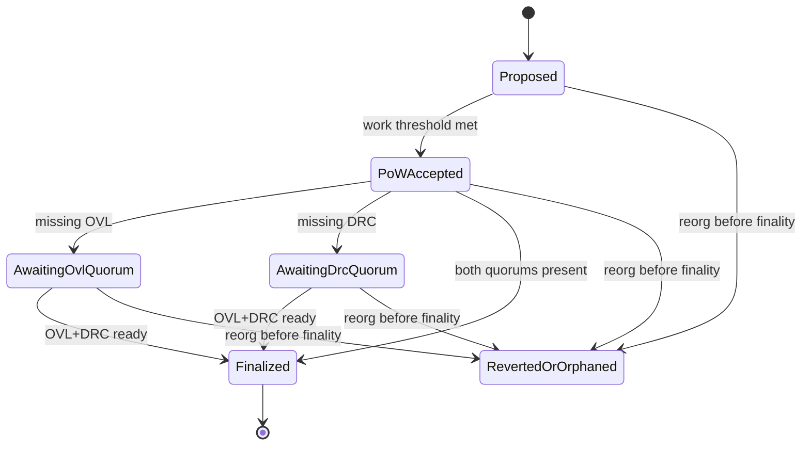

# Hybrid PoW + Dual PoS Finality

**Maturity:** Scaffold (specification). Implementation lands in Phases 3+.

## Roles

| Actor | Asset | Function |
| --- | --- | --- |
| Miners | TLT | Propose blocks, provide RandomX work, order via GHOSTDAG |
| OVL validators | OVL stake | Sign finality checkpoints (≥ ⅔ active voting stake) |
| DRC validators | DRC stake | Sign the same checkpoints (≥ ⅔ active voting stake) |

Validator sets are **logically independent**. Stake is never combined using market prices or oracles.

## Checkpoint lifecycle

PoW blocks may accumulate while a PoS set is unavailable. Those blocks **must** remain explicitly unfinalized. There is no automatic administrator bypass that removes a finality requirement.

## Finality predicate

A checkpoint is `Finalized` iff **all** hold:

1. Required cumulative TLT PoW depth or work threshold (consensus policy).
2. At least two-thirds of **active OVL** voting stake signs the checkpoint.
3. At least two-thirds of **active DRC** voting stake signs the checkpoint.

Quorum math is integer-only: `3 * signed_stake >= 2 * active_stake` (ceil semantics documented in staking modules).

## Attestation domain separation

Each signature binds:

- Chain ID
- Genesis hash
- Consensus-policy hash
- State-transition version
- Checkpoint height or blue score
- Checkpoint block hash
- State root
- Validator-set epoch

Domain tag example: `agora-trident-checkpoint-v1`.

## Equivocation

Evidence structures (minimum):

| Evidence | Effect (default) |
| --- | --- |
| Double checkpoint signature (same validator, conflicting checkpoints, same epoch) | Tombstone + slash |
| Conflicting checkpoint signature | Tombstone + slash |
| Invalid-state attestation (objectively provable) | Jail + slash |
| Validator key compromise report | Governance/process; optional jail |
| Extended downtime | Jail (no tombstone by default) |

Default slash fractions are **conservative** (see staking docs); do not invent extreme percentages without explanation.

## Interaction with acceptance

- Acceptance decides which txs mutate state inside PoW blocks.
- Finality decides when a checkpoint (and its accepted state root) becomes irreversible under normal rules.
- Reorgs may occur **before** finality; reorgs **beyond** a finalized checkpoint are rejected.

## Preserved L1 PoW hardening

GHOSTDAG ordering, virtual UTXO apply, parent-contextual integer DAA, RandomX epoch cache, atomic persistence, and network fingerprinting from `main` PRs #76–#81 remain the PoW substrate. Finality is an additive gadget, not a replacement for that path.
